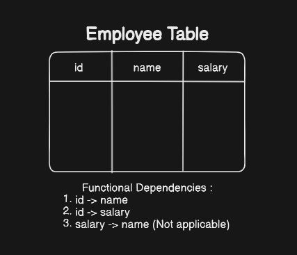

# Functional Dependency & Normalization
[Please refer the pdf for the basic topics of DBMS]

## Normalization :

1. **Database Schema** :
    - Here the schema refers to the blueprint of the database.
    - So a database schema is the design or the blueprint of the actual database that we're going to make.
    - How we will store data, structures of the tables, tables to be formed etc all of these is defined in it.
    - In a RDBMS based database schema we also represent the relations between the tables and how the data from the different tables is related withe each other.

2. **Functional Dependency** :
    - In rdbms we refer columns as attributes and rows as tuples.
    - Functional dependency defines the relationship between two attributes.
    - The general notation of a functional dependency looks like this **X -> Y**. 
    - This notation means that *Y* is dependent on *X*. So ```Y is functionally dependent on X```. Therefore *X is a determinant* and *Y is a dependent*.
    - Y depends on X means, for every valid value of X we can uniquely identify Y.
    

    - In the above employee table the Name & Salary of the employee is depenedent on their id. Since the id of each employee would be unique to themselves.
    - Similarly the salary wont be dependent on name of a employee as there can exist employees with the same name. So determinants should always contain attributes with unique values.